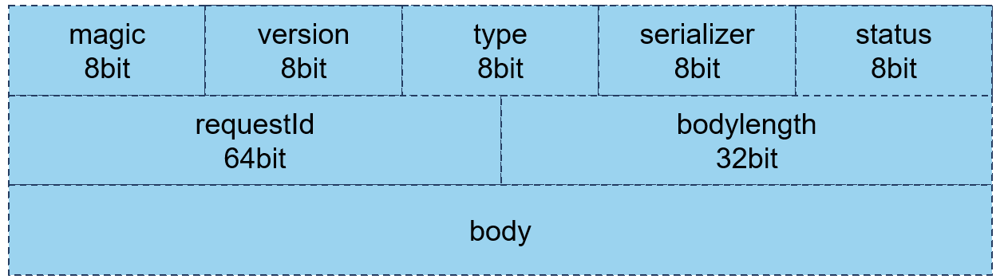
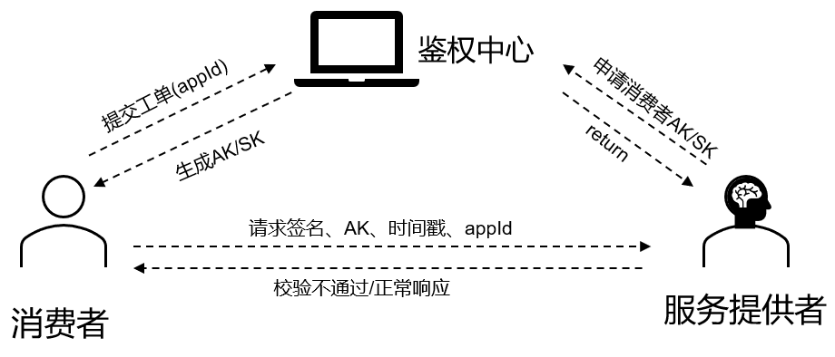

# 🌈 Swiftrpc？
这是一个轮子工程，仿造Dubbo实现的一个rpc项目，亦有不足之处，请谅解

**SwiftRPC的优势**
1. 更小的网络传输消耗：我们自设计RPC协议，形成紧凑的消息结构，确保你的服务调用快速性。
2. 敏感业务的安全认证：针对支付等常见的服务远程调用，我们引入了AK/SK和鉴权中心，确保你的业务安全。
3. 各种Serializer器：包括JDK、JSON、Kryo、Hessian，并引入SPI机制，你可以自己扩展自己的序列化器。
4. 高可用的Rpc：自主实现负载均衡、重试、容错等机制，并通过SPI机制支持用户自主扩展。
5. 便捷使用，我们自定义了@EnableSwiftRPC、@SwiftRpcService、@SwiftRpcReference注解，一行代码启动rpc服务。
# 📚 妙用RPC
## 📕Structures
整个项目分为四部分组成
- **swift_rpc**: 华为云RPC的核心组件，包含网络传输、安全认证、序列化、注册中心等各个组件。
- **swiftrpc_provider**: 服务提供者代码示例。
- **swiftrpc_consumer**: 服务消费者代码示例。
- **swiftrpc_common**: 公共服务抽象接口。

#### 自定义的协议格式
个人设计的协议格式，形成紧凑的数据结构，请求head固定长度未17字节大小


#### 鉴权设计
针对特殊业务场景，我们自定义了一套AK/SK认证流程，实现服务调用身份的验证


## 🚀我该如何使用他？
对于普通的服务调用任务，我们支持使用注解快速启动rpc服务，只需三步
1. 在服务提供者和消费者上添加@EnableSwiftRPC，服务消费者须使用@EnableSwiftRPC(needServer = false)
```java
@SpringBootApplication
@EnableSwiftRPC
public class ExampleProviderApplication {

    public static void main(String[] args) {
        SpringApplication.run(ExampleProviderApplication.class, args);
    }

}
```
2. 提供者服务注解@SwiftRpcService
```java
@Service
@SwiftRpcService
public class UserServiceImpl implements UserServie {
    @Override
    public User getuser(User user) {
        // System.out.println("我给你提供了打印名字的服务哦，你的名字是: "+user.toString());
        user.setName(user.getName()+"txboy");
        return user;
    }
}
```
3. 服务消费者注解@SwiftRpcReference
```java
@SwiftRpcReference
  private UserServie userServie;

  public void test(){
      User user = new User();
      user.setName("tx");
      User result = userServie.getuser(user);
      System.out.println(result.getName());
  }
```
## 🔬简单的配置
由于框架上集成了各种序列化器、以及注册中心，需要你在`application.properties`上配置你选择的属性
```xml
spring.application.name=swift_provider
rpc.name = SWIFT_RPC
rpc.version = 2.0
rpc.port = 10001
rpc.serializer = kryo
```
### 自定义序列化器

我们引入SPI机制，支持高扩展性，只需要在`com.swiftrpc.swift_rpc.serializer.Serializer`引入你自定义的序列化器位置即可，格式如下
```java
jdk=com.swiftrpc.swift_rpc.serializer.JdkSerializer
hessian=com.swiftrpc.swift_rpc.serializer.HessianSerializer
json=com.swiftrpc.swift_rpc.serializer.JsonSerializer
kryo=com.swiftrpc.swift_rpc.serializer.KryoSerializer
```

### 自定义注册中心
我们引入SPI机制，支持高扩展性，只需要在`zk=com.swiftrpc.swift_rpc.registry.Registry`引入你自定义的注册中心位置即可，格式如下
```java
etcd=com.swiftrpc.swift_rpc.registry.EtcdRegistry
zk=com.swiftrpc.swift_rpc.registry.ZookeeperRegistry
```
### 服务鉴权
为了满足特殊业务场景需要服务认证的要求，我们引入AK/SK 机制的认证鉴权机制，并且引入了鉴权服务中心，请在`***`申请。

服务消费者须在鉴权服务中心申请AK/SK对，并在配置文件处设置AK/SK，主要原理是消费端在请求需要鉴权的服务时，会通过 SK、请求元数据、时间戳、参数等信息来生成对应的请求签名，通过 请求体携带到对端进行验签，验签通过才进行业务逻辑处理。
```xml
rpc.accessAk = xxxxxx
rpc.sk = xxxxxx
```
服务提供者在 @SwiftRpcService处设置需要鉴权服务，未通过鉴权则会直接被拒绝
```java
@SwiftRpcService(auth = true)
```
## 🤗 email
如果你有任何问题，请尽管联系我 xiangtang@csu.edu.cn 或者18890399541@163.com
